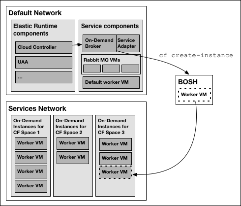

## Overview

Pivotal Cloud Cache (PCC) is a high-performance, high-availability caching layer for Pivotal Cloud Foundry (PCF).
PCC offers an in-memory key-value store. It delivers low-latency responses to a large number of concurrent data access requests.

PCC provides a service broker to create in-memory data clusters on demand.
These clusters are dedicated to the PCF space and tuned for specific use cases defined by your service plan.
Service operators can create multiple plans to support different use cases.

PCC uses Pivotal GemFire. The [Pivotal GemFire API Documentation](http://gemfire-apis.docs.pivotal.io/) details the API for client access to data objects within Pivotal GemFire.

This documentation performs the following functions:

* Describes the features and architecture of PCC
* Provides the PCF operator with instructions for installing, configuring, and maintaining PCC
* Provides app developers instructions for choosing a service plan, creating, and deleting PCC service instances
* Provides app developers instructions for binding apps

## Product Snapshot

The following table provides version and version-support information about PCC:

| Element                    | Details
|----------------------------|:---------
|Version                     |  v1.4.0
|Release date                | May 14, 2018
|Software component version  | GemFire v9.3.0
|Compatible Ops Manager version(s)  | v2.1.x and v2.0.x
|Compatible Pivotal Application Service (PAS)* version(s)  | v2.1.x and v2.0.x
|IaaS support | AWS, Azure, GCP, OpenStack, and vSphere
|IPsec support | Yes
|Required BOSH stemcell version | 3541
|Minimum Java buildpack version required for apps | v3.13

!!! note
    As of PCF v2.0, _Elastic Runtime_ is renamed _Pivotal Application Service (PAS)_ (For more information, see [Pivotal Application Service (PAS) Highlights](http://docs.pivotal.io/pivotalcf/2-0/installing/highlights.html#ert). )

## PCC and Other PCF Services

<%= partial '../../p-cloud-cache/odb/on-demand-service-table' %>

## PCC Architecture

### GemFire Basics

Pivotal GemFire is the data store within Pivotal Cloud Cache (PCC). A small amount of administrative GemFire setup is required for a PCC service instance, and any app will use a limited portion of the GemFire API.

The PCC architectural model is a client-server model. The clients are apps or microservices, and the servers are a set of GemFire servers maintained by a PCC service instance. The GemFire servers provide a low-latency, consistent, fault-tolerant data store within PCC.

GemFire holds data in key/value pairs. Each pair is called an **entry**. Entries are logically grouped into sets called regions. A region is a map (or dictionary) data structure.

The app (client) uses PCC as a cache. A cache lookup (read) is a get operation on a GemFire region. The cache operation of a cache write is a put operation on a GemFire region.
The GemFire command-line interface, called `gfsh`, facilitates region administration. Use `gfsh` to create and destroy regions within the PCC service instance.

### The PCC Cluster

PCC deploys cache clusters that use Pivotal GemFire to provide high availability, replication guarantees, and eventual consistency.

When you first spin up a cluster, you have three locators and at least four servers.

<% mermaid_diagram do %>
  graph TD;
  Client
  subgraph P-CloudCache Cluster
  subgraph locators
  Locator1
  Locator2
  Locator3
  end
  subgraph servers
  Server1
  Server2
  Server3
  Server4
  end
  end
  Client==>Locator1
  Client-->Server1
  Client-->Server2
  Client-->Server3
  Client-->Server4
<% end %>

When you scale the cluster up, you have more servers, increasing the capacity of the cache. There are always three locators.

<% mermaid_diagram do %>
  graph TD;
  Client
  subgraph P-CloudCache Cluster
  subgraph locators
  Locator1
  Locator2
  Locator3
  end
  subgraph servers
  Server1
  Server2
  Server3
  Server4
  Server5
  Server6
  Server7
  end
  end
  Client==>Locator1
  Client-->Server1
  Client-->Server2
  Client-->Server3
  Client-->Server4
  Client-->Server5
  Client-->Server6
  Client-->Server7
<% end %>

### Member Communication

When a client connects to the cluster, it first connects to a locator. The locator replies with the IP address of a server for it to talk to. The client then connects to that server.

<% mermaid_diagram do %>
  sequenceDiagram
    participant Client
    participant Locator
    participant Server1
    Client->>+Locator: What servers can I talk to?
    Locator->>-Client: Server1
    Client->>Server1: Hello!
<% end %>

When the client wants to read or write data, it sends a request directly to the server.

<% mermaid_diagram do %>
  sequenceDiagram
    participant Client
    participant Server1
    Client->>+Server1: What's the value for KEY?
    Server1->>-Client: VALUE
<% end %>

If the server doesn't have the data locally, it fetches it from another server.

<% mermaid_diagram do %>
  sequenceDiagram
    participant Client
    participant Server1
    participant Server2
    Client->>+Server1: What's the value for KEY?
    Server1->>+Server2: What's the value for KEY?
    Server2->>-Server1: VALUE
    Server1->>-Client: VALUE
<% end %>

## Workflow to Set Up a PCC Service

The workflow for the PCF admin setting up a PCC service plan:

<% mermaid_diagram do %>
  graph TD;
  subgraph PCF Admin Actions
  s1
  s2
  end

  subgraph Developer Actions
  s4
  end

  s1[1. Upload P-CloudCache.pivotal to Ops Manager]
  s2[2. Configure CloudCache Service Plans, i.e. caching-small]
  s1-->s2
  s3[3. Ops Manager deploys CloudCache Service Broker]
  s2-->s3
  s4[4. Developer calls `cf create-service p-cloudcache caching-small test`]
  s3-->s4
  s5[5. Ops Manager creates a CloudCache cluster following the caching-small specifications]
  s4-->s5
<% end %>

## Networking for On-Demand Services

This section describes networking considerations for Pivotal Cloud Cache.

### BOSH 2.0 and the Service Network

<%= partial '../../p-cloud-cache/odb/service_networks' %>

### Default Network and Service Network

Like other on-demand PCF services, PCC relies on the BOSH 2.0 ability to dynamically deploy VMs in a dedicated network. The on-demand service broker uses this capability to create single-tenant service instances in a dedicated service network.

<%= partial '../../p-cloud-cache/odb/on_demand_architecture' %>

The diagram below shows worker VMs in an on-demand service instance, such as RabbitMQ for PCF, running on a separate services network, while other components run on the default network.

### Required Networking Rules for On-Demand Services

<%= partial '../../p-cloud-cache/odb/service_networks_table' %>

 
Regardless of the specific network layout, the operator must ensure network
rules are set up so that connections are open as described in the table below.

<table class="nice">
  <th>This component...</th>
  <th>Must communicate with...</th>
  <th>Default TCP Port</th>
  <th>Communication direction(s)</th>
  <th>Notes</th>
  <tr>
    <td><strong>ODB</strong></td>
    <td>
        <ul>
            <li><strong>BOSH Director</strong></li>
          <li><strong>BOSH UAA</strong></li>
        </ul>
    </td>
    <td>
      <ul>
        <li>25555</li>
        <li>8443</li>
      </ul>
    </td>
    <td>One-way</td>
    <td>The default ports are not configurable.</td>
  </tr>
  <tr>
    <td><strong>ODB</strong></td>
    <td><strong>Deployed service instances</strong>
    </td>
    <td>Specific to the service (such as RabbitMQ for PCF).
      May be one or more ports.</td>
    <td>One-way</td>
    <td>This connection is for administrative tasks.
      Avoid opening general use, app-specific ports for this connection.</td>
  </tr>
  <tr>
    <td><strong>ODB</strong></td>
    <td><strong>PAS (or Elastic Runtime) </strong>
    </td>
    <td>8443</td>
    <td>One-way</td>
    <td>The default port is not configurable.</td>
  </tr>
  <tr>
    <td><strong>Errand VMs</strong></td>
    <td>
      <ul>
        <li><strong>PAS (or Elastic Runtime) </strong></li>
        <li><strong>ODB</strong></li>
        <li><strong>Deployed Service Instances</strong></li>
      </ul>
    </td>
    <td>
      <ul>
        <li>8443</li>
        <li>8080</li>
        <li>Specific to the service. May be one or more ports.</li>
      </ul>
    </td>
    <td>One-way</td>
    <td>The default port is not configurable.</td>
  </tr>
  <tr>
    <td><strong>BOSH Agent</strong></td>
    <td><strong>BOSH Director</strong>
    </td>
    <td>4222</td>
    <td>Two-way</td>
    <td>The BOSH Agent runs on every VM in the system, including the BOSH Director VM.
      The BOSH Agent initiates the connection with the BOSH Director. 
      The default port is not configurable.  </td>
  </tr>
  <tr>
    <td><strong>Deployed apps on PAS (or Elastic Runtime) </strong></td>
    <td><strong>Deployed service instances</strong>
    </td>
    <td>Specific to the service. May be one or more ports.</td>
    <td>One-way</td>
    <td>This connection is for general use, app-specific tasks.
      Avoid opening administrative ports for this connection.</td>
  </tr>
  <tr>
    <td><strong>PAS (or Elastic Runtime) </strong></td>
    <td><strong>ODB</strong>
    </td>
    <td>8080</td>
    <td>One-way</td>
    <td>This port may be different for individual services.
      This port may also be configurable by the operator if allowed by the
      tile developer.</td>
  </tr>
</table>

### PCC Instances Across WAN

PCC service instances running within distinct PCF foundations
may communicate with each other across a WAN.
In a topology such as this,
the members within one service instance use their own private address space,
as defined in [RFC1918](https://tools.ietf.org/html/rfc1918).

A VPN may be used to connect the private network spaces that lay
across the WAN.
The steps required to enable the connectivity by VPN are dependent
on the IaaS provider(s).

The private address space for each service instance's network
must be configured with non-overlapping CIDR blocks.
Configure the network prior to creating service instances.
Locate directions for creating a network on the appropriate IAAS provider
within the section titled
[Architecture and Installation Overview](https://docs.pivotal.io/pivotalcf/installing/index.html).

## Recommended Usage and Limitations

- PCC supports the [look-aside cache pattern](./app-development.html#lookaside-cache).
- PCC stores objects in key/value format, where value can be any object.
- Any gfsh command not explained in the PCC documentation is **not supported**.
- PCC supports basic OQL queries, with no support for joins.

### Limitations

- Scale down of the cluster is not supported.
- Plan migrations, for example, `-p` flag with the `cf update-service` command, are not supported.

## Security

Pivotal recommends that you do the following:

- Run PCC in its own network
- Use a load balancer to block direct, outside access to the Gorouter

To allow PCC network access from apps, you must create application security groups that allow access on the following ports:

* 1099
* 8080
* 40404
* 55221

For more information, see the PCF [Application Security Groups](https://docs.pivotal.io/pivotalcf/adminguide/app-sec-groups.html#creating-groups) topic.

PCC works with the IPsec Add-on for PCF.
For information about the IPsec Add-on for PCF,
see [Securing Data in Transit with the IPsec Add-on](https://docs.pivotal.io/addon-ipsec/index.html).

### Authentication

PCC service instances are created with three default GemFire user roles for
interacting with clusters:

- A cluster operator manages the GemFire cluster and can access
region data.
- A developer can access region data.
- A gateway sender propagates region data to another PCC service instance.

All client apps, gfsh, and JMX clients must authenticate as
one of these user roles to access the cluster.

The identifiers assigned for these roles are detailed in
[Create Service Keys](accessing-instance.html#create-service-key).

### Authorization

Each user role is given predefined permissions for cluster operations.
To accomplish a cluster operation,
the user authenticates using one of the roles.
Prior to initiating the requested operation,
there is a verification that the
authenticated user role has the permission authorized to do the operation.
Here are the permissions that each user role has:

- The  cluster operator role has
`CLUSTER:MANAGE`,
`CLUSTER:WRITE`,
`CLUSTER:READ`,
`DATA:MANAGE`,
`DATA:WRITE`,
 and `DATA:READ` permissions.
- The developer role has
`CLUSTER:READ`,
`DATA:WRITE`,
and `DATA:READ` permissions.
- The gateway sender role has `DATA:WRITE` permission.

More details about these permissions are in the Pivotal GemFire manual under [Implementing Authorization](http://gemfire.docs.pivotal.io/geode/managing/security/implementing_authorization.html).

## Feedback
Please provide any bugs, feature requests, or questions to the [Pivotal Cloud Foundry Feedback list](mailto:pivotal-cf-feedback@pivotal.io).
